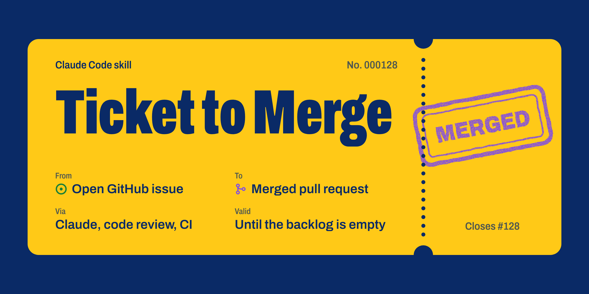
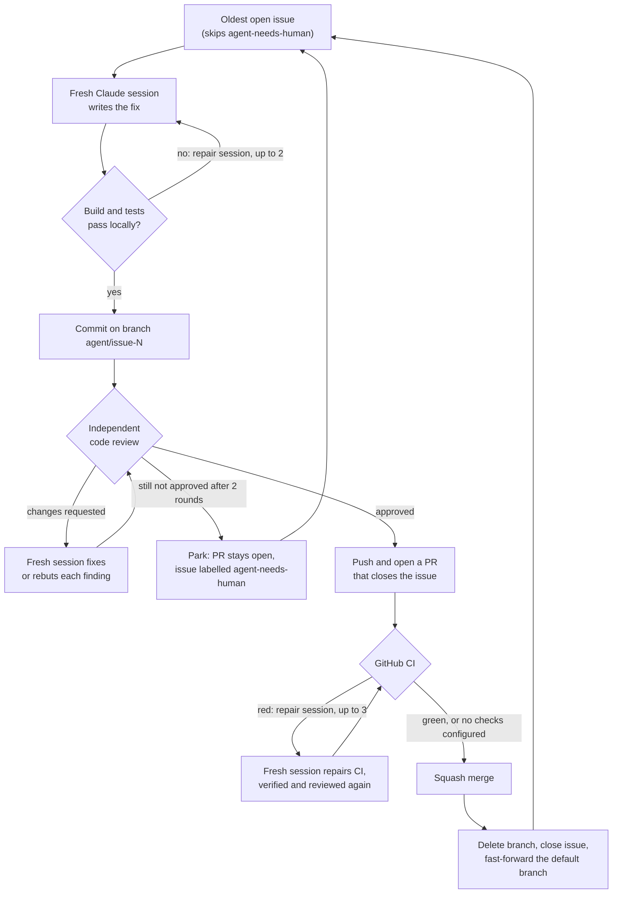

<p align="center">
  
</p>

# Ticket to Merge: autonomous GitHub issue solver for Claude Code

[](LICENSE)


[](https://code.claude.com/docs/en/skills)

**Ticket to Merge** is a [Claude Code](https://code.claude.com/docs/en/overview) skill that works through every
open GitHub issue in your repository, oldest first, with nobody at the keyboard. For each issue it starts a fresh
Claude session to write the fix, runs your build and tests, gets the commits approved by an independent AI code
reviewer, opens a pull request that closes the issue, waits for CI (and repairs red builds), squash-merges, and moves
on to the next one. Issues the reviewer won't approve are parked for a human instead of merged.

Start it in the evening, and review the merged and parked pull requests in the morning.

> [!WARNING]
> The workers run `claude -p --dangerously-skip-permissions`: they edit files and run commands on your machine
> without asking, and approved fixes are merged into your default branch automatically. Only run it on repositories
> and machines you trust. A deny list stops workers from committing, pushing or touching issues and pull requests,
> but it is a safety net, not a sandbox.

## Features

- **One issue, one fresh session.** The worker, the reviewer and every repair run in a new non-interactive
  `claude -p` session that is never resumed, so context never bleeds from one issue into the next.
- **Code review gate before every push.** A read-only reviewer session must approve the commits. It blocks only on
  bugs, unsolved issue requirements, missing tests and broken `CLAUDE.md` / `AGENTS.md` rules, never on style. A
  fixer session fixes or rebuts each finding, then a narrow re-review follows. Every approval is posted on the PR.
- **Parks instead of merging doubtful code.** If the last re-review still requests changes, the PR stays open with
  the findings, the issue gets the label `agent-needs-human`, and the loop moves on.
- **CI-aware.** Waits for the GitHub checks on the PR. Red CI gets up to 3 fresh repair sessions, and each repair is
  verified and reviewed again before it is pushed.
- **Respects branch protection.** Merges with `gh pr merge --squash --match-head-commit`, never with `--admin`, and
  never while CI is red or uncertain.
- **Survives usage limits.** When a session hits the Claude 5-hour or weekly limit, the loop sleeps until the reset
  and re-runs that session.
- **Never loses work.** On any failure it stops and keeps unfinished changes on a local
  `agent/failed-issue-N-<timestamp>` branch.
- **Follows your repository's rules.** Workers read your `CLAUDE.md`, the supervisor runs your own build and test
  commands, and protected paths are never pushed.

## How it works

A Python supervisor (`run_issues.py`) does all git and GitHub work itself. Claude only edits code and reviews it.



## Requirements

- **Windows 10 or 11.** The supervisor uses Windows-only APIs (an `msvcrt` file lock, `taskkill`, toast
  notifications). macOS and Linux are not supported yet.
- **Python 3.10** or newer.
- **[Claude Code](https://code.claude.com/docs/en/overview)**, signed in. Use a recent version: the skill locates its
  script through `${CLAUDE_SKILL_DIR}`.
- **Git**, with `user.name` and `user.email` configured.
- **[GitHub CLI](https://cli.github.com/)**, signed in with `gh auth login`, with write access to the repository.
- A local clone with a GitHub `origin` remote and a clean working tree.

## Installation

### As a Claude Code plugin

In Claude Code:

```text
/plugin marketplace add AIPris/ticket-to-merge
/plugin install ticket-to-merge@ticket-to-merge
```

The skill is then available as `/ticket-to-merge:issue-loop`.

### As a personal skill

In PowerShell:

```powershell
git clone https://github.com/AIPris/ticket-to-merge.git
New-Item -ItemType Directory -Force "$env:USERPROFILE\.claude\skills" | Out-Null
Copy-Item -Recurse -Force .\ticket-to-merge\skills\issue-loop "$env:USERPROFILE\.claude\skills\"
```

The skill is then available as `/issue-loop`. To update, `git pull` and run the copy command again.

## Usage

Open Claude Code in the repository you want to work through. If you installed the plugin, type
`/ticket-to-merge:issue-loop` instead of `/issue-loop`.

| Command | What it does |
|---|---|
| `/issue-loop` | Works through all open issues until none are left |
| `/issue-loop --max-issues 1` | Solves one issue, then stops |
| `/issue-loop --check` | Preflight only: checks tools, sign-ins and the working tree, and shows the next issue |

Claude runs the preflight first and shows you the result. It reminds you that workers skip permission prompts and
that merges happen automatically, then waits for your go-ahead. The loop runs in the background, so you can keep
using the session, but don't edit, check out or commit anything in that repository while it runs: the supervisor
needs a clean working tree. Ask how the loop is doing at any time; Claude checks `--status`, which looks like this:

```text
RUNNING since 23:14:02
  issue:  #42 Add CSV export to the report page
  stage:  code review (round 1)
  merged: 3 issue(s) this run, parked: 1
  last activity: 37s ago
```

You can also run the supervisor without Claude Code driving it:

```powershell
python skills\issue-loop\run_issues.py --repo C:\path\to\your-repo --check
python skills\issue-loop\run_issues.py --repo C:\path\to\your-repo --max-issues 1
python skills\issue-loop\run_issues.py --repo C:\path\to\your-repo --status
```

## Configuration

Settings are optional. Put them in `.issue-loop.json` at the root of the target repository and commit the file,
because the supervisor refuses to start on a dirty working tree.

```json
{
  "verify": ["npm run build", "npm test"],
  "protected_paths": ["vendor/"],
  "model": "opus",
  "review_rounds": 2
}
```

| Key | Default | Meaning |
|---|---|---|
| `verify` | auto-detected | Commands the supervisor runs after every worker session. All must pass before anything is committed |
| `protected_paths` | none | Path prefixes a change must not touch. If it does, the loop stops before pushing |
| `model` | Claude Code default | Model for every session, for example `"opus"` |
| `worker_max_turns` | `200` | Turn limit for the session that solves an issue |
| `ci_repair_max_turns` | `100` | Turn limit for CI repair, local repair and review-fix sessions |
| `ci_repair_attempts` | `3` | Repair sessions after red CI before the loop stops |
| `local_repair_attempts` | `2` | Repair sessions when the supervisor's own verification fails |
| `review` | `true` | `false` turns the code review gate off |
| `review_rounds` | `2` | Fix and re-review rounds before an issue is parked |
| `review_max_turns` | `80` | Turn limit for each review session |

Without `verify`, the commands are auto-detected: `npm run build` and `npm test` when `package.json` defines those
scripts, otherwise `python -m pytest -q` when the repository has a `pytest.ini`, `tox.ini`, `conftest.py` or
`pyproject.toml`.

## When something goes wrong

| Situation | What the loop does |
|---|---|
| The worker reports the issue as blocked (ambiguous, needs a decision) | Stops, and keeps any changes on a local `agent/failed-issue-N-*` branch |
| Local build or tests fail | Starts up to 2 repair sessions, then stops |
| The reviewer requests changes | A fixer session fixes or rebuts each finding, then the reviewer looks again. After 2 rounds the issue is parked |
| CI fails | Starts up to 3 repair sessions, each reviewed again, then stops with the PR left open |
| Branch protection blocks the merge | Stops and leaves the PR open. It never bypasses protection |
| A Claude usage limit is hit | Sleeps until the reported reset time plus 2 minutes, then re-runs that session |
| Any other API error (overloaded, 5xx) | Stops |

Before it starts, the preflight refuses to run when the working tree has uncommitted or untracked files, when you are
on a branch other than the default branch or an `agent/issue-N` branch, or when the local default branch has
commits that are not on `origin`. The default branch is only ever fast-forwarded, never reset.

## Status, logs and notifications

- `run_issues.py --status` shows whether a loop is running, the current issue and stage, how many issues were merged
  or parked, and how long ago the last activity was. It flags a loop as possibly stuck after 10 quiet minutes.
- Every session's prompt and full transcript are saved under `%LOCALAPPDATA%\issue-loop\logs\<repo>\`.
- Windows toast notifications tell you when an issue starts, is merged or parked, when CI fails, when a usage limit
  pauses the loop, and when the loop finishes or stops.

## FAQ

**Can Claude Code fix GitHub issues without me?**
Yes. That is what this skill does: it reads each open issue with its comments, implements a fix in a fresh Claude
session, and only merges what passes your local checks, the AI code review and CI.

**Does a human review the code before it is merged?**
No. Approved fixes are merged by the supervisor without a human in the loop. If you want a person to approve every
PR, require reviews in your branch protection rules. The loop then stops at the merge step and leaves the PR open,
because it never bypasses protection.

**Which issues does it pick?**
All open issues, oldest first, except those labelled `agent-needs-human`. Add that label to any issue you want the
loop to skip.

**How do I retry a parked issue?**
Remove the `agent-needs-human` label. On the next run the loop picks up the existing `agent/issue-N` branch and
reviews it again from scratch.

**Does it work on macOS or Linux?**
Not yet. The process handling and notifications are Windows-specific. Pull requests that add macOS and Linux support
are welcome.

**What does it cost?**
It uses your Claude Code plan or API key like any other Claude Code session. With the review gate on, each issue
takes at least two sessions (worker and reviewer), and every fix round, re-review and repair adds one more.

## Contributing

Issues and pull requests are welcome. Please describe what you ran and on which Windows and Python versions.

## License

[MIT](LICENSE)

Ticket to Merge is an independent community project. It is not affiliated with or endorsed by Anthropic. Claude is a
trademark of Anthropic.
